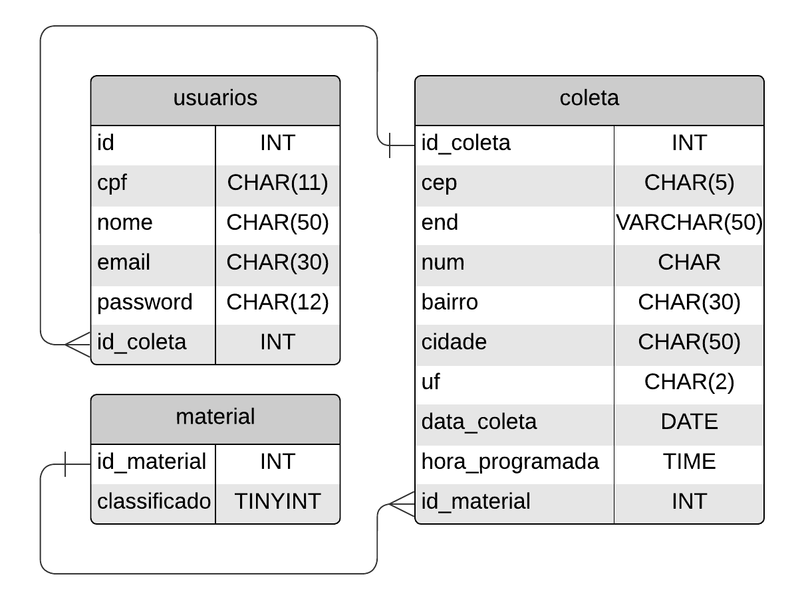

# :recycle: Smart Coleta

Projeto Integrador **UNIVESP**, polo Pirassununga sobre a gestão sustentável da coleta seletiva que pode ser vista online no site:  https://projetointegradorwebsite.herokuapp.com

     


## Instalação

`useradd -m usuario;passwd usuario;usermod -a -G sudo usuario;chsh -s /bin/bash usuario`

```bash
git clone https://github.com/tonmarcondes/smartColeta.git
cd smartColeta
pip install -r requirements.txt
flask run
```
## Banco de dados relacional

O banco de dados usado para este projeto foi o MySQL com os relacionamentos que seguem de acordo com o modelo abaixo:



## Integrantes

| Nome | RA |
:---|---
|Carlos Alberto Prevato Junior|2015284|
|Carlos Eduardo Fávaro da Silva Pessoa|2003774|
|David Machado de Avela|2005036|
|Marcelo Silvestre|2007881|
|Patrick da Silva Américo|2015736|
|Wellyngton Marcondes|2014425|
